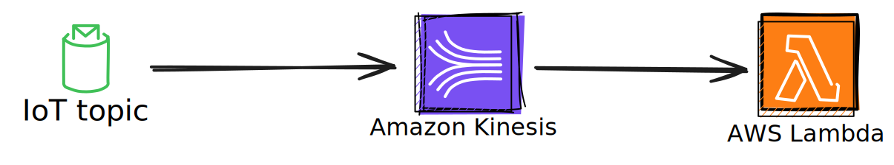

# AWS IoT Rule to AWS Kinesis Data Streams to AWS Lambda in Rust
When a message is published to the IoT topic, the message will be delivered to AWS Kinesis Data Stream.
A Consumer lambda is polling for the stream using an EventSourceMapping and logs the events.

https://docs.aws.amazon.com/AWSCloudFormation/latest/UserGuide/aws-resource-lambda-eventsourcemapping.html

## AWS Infrastructure


## Requirements
- AWS Account
- AWS CLI
- Terraform
- Rust

## Deployment

Navigate to /infrastructure folder and run:

```
terraform init
```

```
terraform plan
```

```
terraform apply
```

## Cleanup

```
terraform destroy
```

## Test

